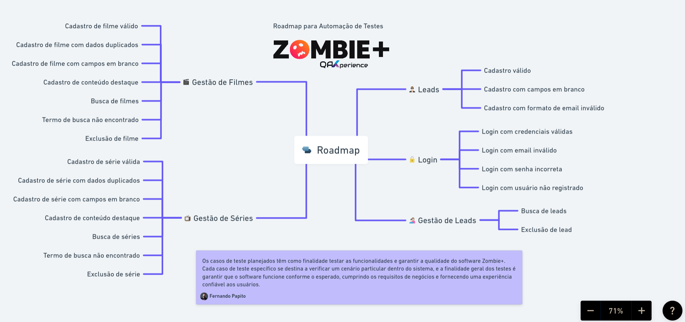

# Test-PWZ: Playwright Testing Framework for Zombie+

This project is a comprehensive testing framework built with Playwright to perform automated testing on the Zombie+ application. It includes tests for both the admin panel and the landing page, covering various functionalities such as authentication, movie management, and lead registration.

## Architecture

The project follows a well-structured architecture designed for maintainability and reusability:

### Project Structure

```
test-pwz/
├── tests/                    # Main test directory
│   ├── actions/              # Test actions including auth setup and DB operations
│   │   ├── auth.setup.ts     # Authentication setup for tests
│   │   ├── api/              # API interaction actions
│   │   └── db/               # Database operation actions
│   ├── config/               # Configuration files
│   │   └── dbConfig.ts       # Database configuration
│   ├── contexts/             # Test contexts for different pages
│   │   ├── appContexts.ts    # Main application context
│   │   ├── landingContext.ts # Landing page context
│   │   ├── loginContext.ts   # Login page context
│   │   ├── moviesContext.ts  # Movies page context
│   │   └── toastContext.ts   # Toast notifications context
│   ├── fixtures/             # Test fixtures and test data
│   │   └── data/             # Test data files
│   ├── pages/                # Page Object Models
│   │   ├── admin/            # Admin page objects
│   │   ├── components/       # Reusable component objects
│   │   └── landing/          # Landing page objects
│   ├── specs/                # Test specifications
│   │   ├── admin/            # Admin panel tests
│   │   └── landing/          # Landing page tests
│   └── types/                # TypeScript type definitions
├── zombie/                   # Zombie+ application (API and webapp for testing)
│   ├── api/                  # Backend API
│   ├── web/                  # Frontend web application
│   └── docker-compose.yml    # Docker configuration for local development
└── playwright.config.js      # Playwright configuration
```

### Design Pattern - Page Object Model

This project uses the Page Object Model (POM) design pattern, which separates the test code from the page-specific code. Each page in the application has its own class that encapsulates the elements and actions that can be performed on that page.

### Contexts System

The contexts system is a key architectural feature that helps manage test setup and state. Each context:

1. Initializes specific pages and components
2. Provides those instances to the tests
3. Allows for modular and reusable test configurations

## How to Run the Zombie+ Application for Testing

The Zombie+ application is included in the `zombie` directory and consists of a PostgreSQL database, an API, and a web application. Follow these steps to run it:

### Prerequisites

- Docker and Docker Compose
- Node.js (v14 or later)
- npm or yarn

### Step 1: Start the Database

1. Navigate to the zombie directory:
   ```bash
   cd zombie
   ```

2. Run Docker Compose to start the PostgreSQL database and pgAdmin:
   ```bash
   docker-compose up -d
   ```

   This will start:
   - PostgreSQL database on port 5432
   - pgAdmin web interface on port 16543 (accessible at http://localhost:16543)
     - Username: admin@qax.com
     - Password: pwd123

### Step 2: Set Up and Run the API

1. Navigate to the API directory:
   ```bash
   cd zombie/api
   ```

2. Install dependencies:
   ```bash
   npm install
   ```

3. Set up the database:
   ```bash
   sh db.sh
   ```
   This will run migrations and seed the database with initial data.

4. Start the API server:
   ```bash
   npm run dev
   ```
   The API will be available at http://localhost:3333

### Step 3: Run the Web Application

1. Navigate to the web directory:
   ```bash
   cd zombie/web
   ```

2. Install dependencies:
   ```bash
   npm install
   ```

3. Start the web server:
   ```bash
   npm run dev
   ```
   The web application will be available at http://localhost:3000

## Running Tests

Once the Zombie+ application is running, you can execute the tests:

```bash
npm test                 # Run all tests
npm run test:ui          # Run tests with UI mode
npm run test:debug       # Run tests in debug mode
```

## Contexts in Detail

A context in the contexts directory is responsible for setting up and configuring the environment for specific parts of the application before running tests. It initializes the necessary pages and components, ensuring that they are ready for interaction during the test execution. Contexts help in modularizing the setup process, making it easier to manage and reuse configurations across different tests.

How to setup a context:

1. Import the Page from pw and the page object model to use:

```ts
import { LandingPage } from '@pages/landing/Leeds';
import { Page } from '@playwright/test';
```

2. Define a fixture type

```ts
type LandingFixtures = {
  landing: (
    { page }: { page: Page },
    use: (landing: LandingPage) => Promise<void>
  ) => Promise<void>;
};
```

3. Define a page fixture by instancing the page object model

```ts
const landingFixtures: LandingFixtures = {
  landing: async (
    { page },
    use: (landing: LandingPage) => Promise<void>
  ) => {
    const landing = new LandingPage(page);
    await use(landing);
  },
};
```

4. Export it to use in appContexts

```ts
export { landingFixtures };
```

5. Using in the appContexts

   1. import the page to use as type:

   ```ts
   import { LandingPage } from '@pages/landing/Leeds';
   ```

   2. set the page name to use and def the type:

   ```ts
   type AppFixtures = {
     context: BrowserContext;
     page: Page;
     ...
     landing: LandingPage;
   };
   ```

   3. extend the context properties:

   ```ts
   const test = playwrightTest.extend<AppFixtures>({
     ...,
     ...landingFixtures,
     context: async ({ browser }, use) => {...},
     page: async ({ context }, use) => {...},
   });

   export { test };
   ```

6. Using the contexts in tests:

```ts
// import the custom test with the contexts
import { test } from '@contexts/appContexts';

// use the contexts as params
test('Should register a lead in a waiting list', async ({
  landing,
  toast,
}) => {
  await landing.open();
  await landing.openLeadModal();

  await landing.submitLeadForm(leadName, leadEmail);

  await toast.checkContainText(/Agradecemos/);
});
```

## Pages

A page in the pages directory represents a specific page object model of the application under test and use class. It encapsulates the interactions and verifications that can be performed on that page, providing a clean and reusable interface for the tests. Each page class typically includes methods for navigating to the page, interacting with elements, and asserting conditions.

Example:

```ts
import { expect, Page } from '@playwright/test';

export class LoginAdminPage {
  private readonly page: Page;

  constructor(page: Page) {
    this.page = page;
  }

  async open() {
    await this.page.goto('http://localhost:3000/admin/login');
    const loginForm = this.page.locator('.login-form');
    await expect(loginForm).toBeVisible();
  }
}
```

## Specs

A spec in the specs directory defines the actual tests that will be executed to verify the functionality of the application. Each spec file typically corresponds to a specific feature or workflow within the application. The tests within a spec file use the contexts, pages, and components defined in other directories to perform actions and assert conditions.

Example: Admin Login Spec
The following example demonstrates a spec that tests the admin login functionality. It uses the test object from the appContexts to access the login and movies fixtures.

Example spec:

```ts
import { test } from '@contexts/appContexts';

test('Should login as admin', async ({ login, movies }) => {
  await login.open();
  await login.submitLoginForm();
  await movies.checkLoggedIn();
});
```

## Flow to create a test

1. Define the Page Object Model
   Create a class for the page you want to interact with. This class should encapsulate all the interactions and verifications for that page.

Sure, here is a complete flow describing the creation of a test using the pages, fixtures, and specs directories:

Step-by-Step Guide

1. Define the Page Object Model
   Create a class for the page you want to interact with. This class should encapsulate all the interactions and verifications for that page.

2. Define the Fixture
   Create a fixture for the page. This fixture will initialize the page object and make it available for the tests.

3. Extend the Context
   Extend the context to include the new fixture in `appContexts.ts`. This will make the fixture available in the tests.

4. Write the Test Spec
   Create a test spec that uses the context and fixtures to perform actions and assertions.

Summary:

1. Define the Page Object Model: Create a class in the pages directory that encapsulates interactions with a specific page.
2. Define the Fixture: Create a fixture in the contexts directory that initializes the page object.
3. Extend the Context: Extend the context in the appContexts.ts file to include the new fixture.
4. Write the Test Spec: Create a test spec in the specs directory that uses the context and fixtures to perform actions and assertions.

## Zombie+ Test Scenarios

Os casos de teste planejados têm como finalidade testar as funcionalidades e garantir a qualidade do software Zombie+. Cada caso de teste específico se destina a verificar um cenário particular dentro do sistema, e a finalidade geral dos testes é garantir que o software funcione conforme o esperado, cumprindo os requisitos de negócios e fornecendo uma experiência confiável aos usuários.

### Landing Page

Os testes nesse conjunto verificam a funcionalidade de cadastro e autenticação de leads na fila de espera, garantindo que os leads possam se cadastrar com sucesso e que a autenticação funcione corretamente.

#### Fila de espera (Leads)

- Cadastro válido
- Ação: Preencher todos os campos obrigatórios (nome e email) com informações válidas e clicar em "Cadastrar".
- Resultado esperado: O lead é cadastrado com sucesso no sistema.
- Cadastro com campos em branco
- Ação: Deixar os campos de nome e/ou email em branco e clicar em "Cadastrar".
- Resultado esperado: Uma mensagem de erro deve ser exibida, informando que os campos obrigatórios devem ser preenchidos.
- Cadastro com formato de email inválido
- Ação: Preencher o campo de email com um formato inválido e preencher o campo de nome corretamente, depois clicar em "Cadastrar".
- Resultado esperado: Uma mensagem de erro é exibida, informando que o formato do email é inválido.

#### Autenticação (Login)

- Login com credenciais válidas
- Ação: Informar um email e senha válidos de um usuário registrado e clicar em "Login".
- Resultado esperado: O usuário é redirecionado para a área logada do sistema.
- Login com email inválido
- Ação: Informar um email inválido e uma senha válida e clicar em "Login".
- Resultado esperado: Uma mensagem de erro deve ser exibida, informando que o email é inválido.
- Login com senha incorreta
- Ação: Informar um email válido e uma senha incorreta e clicar em "Login".
- Resultado esperado: Uma mensagem de erro deve ser exibida, informando que a senha está incorreta.
- Login com usuário não registrado
- Ação: Informar um email não registrado e uma senha e clicar em "Login".
- Resultado esperado: Uma mensagem de erro deve ser exibida, informando que o usuário não está registrado no sistema.

### Admin

Esses testes visam validar as operações de cadastro, busca e exclusão de filmes e séries na administração do sistema. Eles garantem que os dados sejam armazenados corretamente, que as buscas retornem resultados precisos e que a exclusão de conteúdo seja realizada sem problemas.

#### Gestão de Filmes

##### Cadastro

- Cadastro de filme válido
- Ação: Preencher todos os campos obrigatórios do formulário de cadastro de filme com informações válidas e clicar em "Cadastrar".
- Resultado esperado: O filme é cadastrado com sucesso no sistema.
- Cadastro de filme com campos em branco
- Ação: Deixar pelo menos um campo obrigatório em branco e clicar em "Cadastrar".
- Resultado esperado: Uma mensagem de erro deve ser exibida, informando que os campos obrigatórios devem ser preenchidos.
- Cadastro de série com dados duplicados
- Ação: Preencher o formulário com informações de uma série já cadastrada e clicar em "Cadastrar".
- Resultado esperado: Uma mensagem de erro deve ser exibida, informando que a série já está cadastrada no sistema.
- Cadastro de conteúdo destaque
- Ação: Preencher todos os campos obrigatórios e marcar o filme como destaque.
- Resultado esperado: O filme marcado como destaque é exibida na landing page.

##### Busca

- Busca de filmes
- Ação: Realizar uma busca por título de filme existente.
- Resultado esperado: A lista de filmes correspondentes ao critério de busca é exibida.
- Termo de busca não encontrado
- Ação: Realizar a busca por título de filme que não existe.
- Resultado esperado: Uma mensagem de erro deve ser exibida, informando que a busca não retornou dados conforme o termo de busca.

##### Exclusão

- Exclusão de filme
- Ação: Selecionar um filme da lista e clicar em "Excluir".
- Resultado esperado: O filme é removido com sucesso do sistema.

#### Gestão de Séries

##### Cadastro

- Cadastro de série válida
- Ação: Preencher todos os campos obrigatórios do formulário de cadastro de série com informações válidas e clicar em "Cadastrar".
- Resultado esperado: A série é cadastrada com sucesso no sistema.
- Cadastro de série com dados duplicados
- Ação: Preencher o formulário com informações de uma série já cadastrada e clicar em "Cadastrar".
- Resultado esperado: Uma mensagem de erro deve ser exibida, informando que a série já está cadastrada no sistema.
- Cadastro de série com campos em branco
- Ação: Deixar pelo menos um campo obrigatório em branco e clicar em "Cadastrar".
- Resultado esperado: Uma mensagem de erro deve ser exibida, informando que os campos obrigatórios devem ser preenchidos.
- Cadastro de conteúdo destaque
- Ação: Preencher todos os campos obrigatórios e marcar a série como destaque.
- Resultado esperado: A série marcada como destaque é exibida na landing page.

##### Busca

- Busca de séries
- Ação: Realizar uma busca por título de série existente.
- Resultado esperado: A lista de séries correspondentes ao critério de busca é exibida.
- Termo de busca não encontrado
- Ação: Realizar a busca por título de série que não existe.
- Resultado esperado: Uma mensagem de erro deve ser exibida, informando que a busca não retornou dados conforme o termo de busca.

##### Exclusão

- Exclusão de série
- Ação: Selecionar uma série da lista e clicar em "Excluir".
- Resultado esperado: A série é removida com sucesso do sistema.

### Gestão Leads

Esses testes se concentram na funcionalidade de gerenciamento de leads, incluindo listagem, busca e exclusão de leads no sistema. Eles asseguram que os dados dos leads sejam exibidos corretamente, que a busca funcione e que os leads possam ser removidos conforme necessário.

- Busca de leads
- Ação: Realizar uma busca por nome de lead existente.
- Resultado esperado: A lista de leads correspondentes ao critério de busca é exibida.
- Exclusão de lead
- Ação: Selecionar um lead da lista e clicar em "Excluir".
- Resultado esperado: O lead é removido com sucesso do sistema.

## Roadmap


